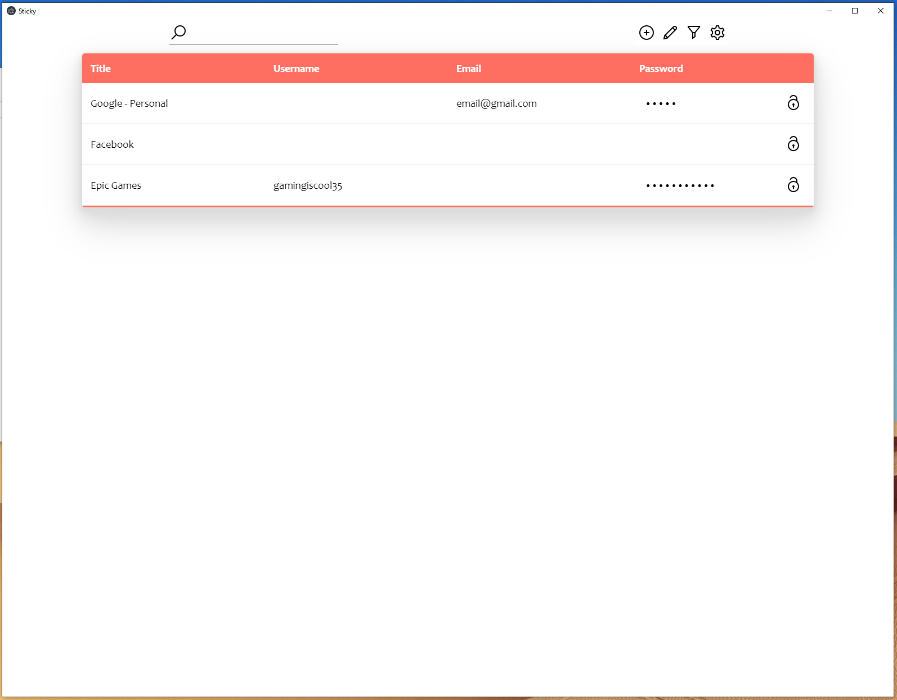
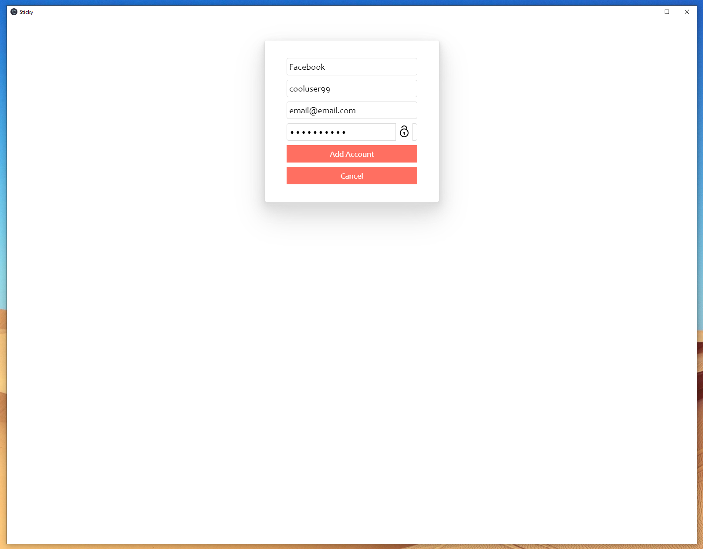
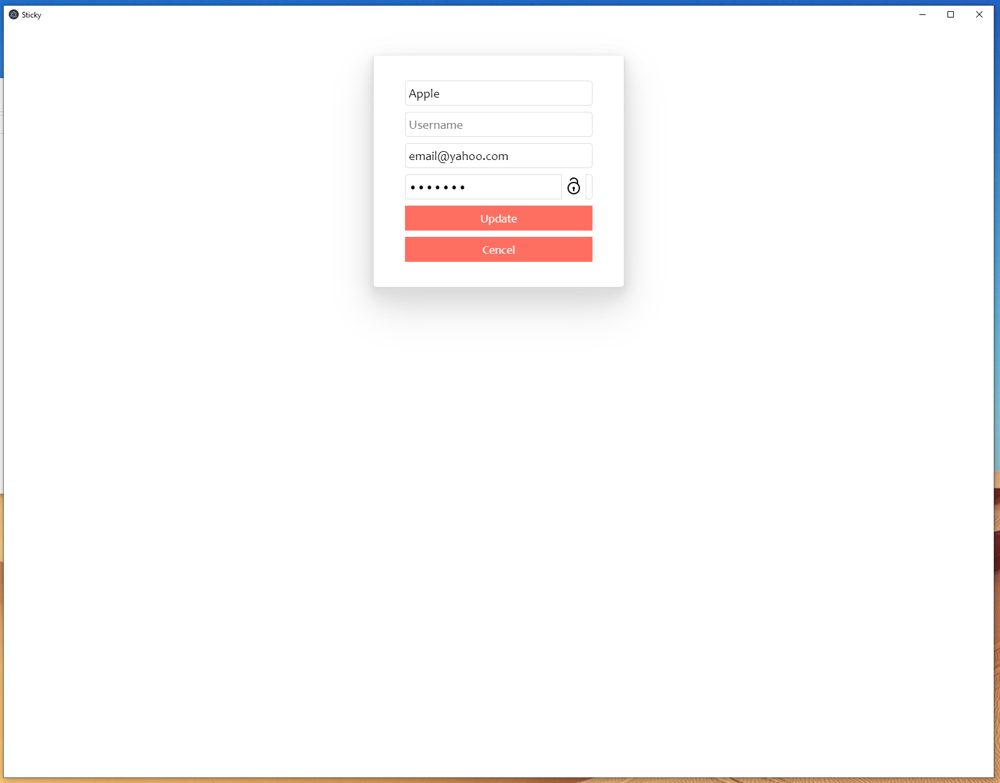
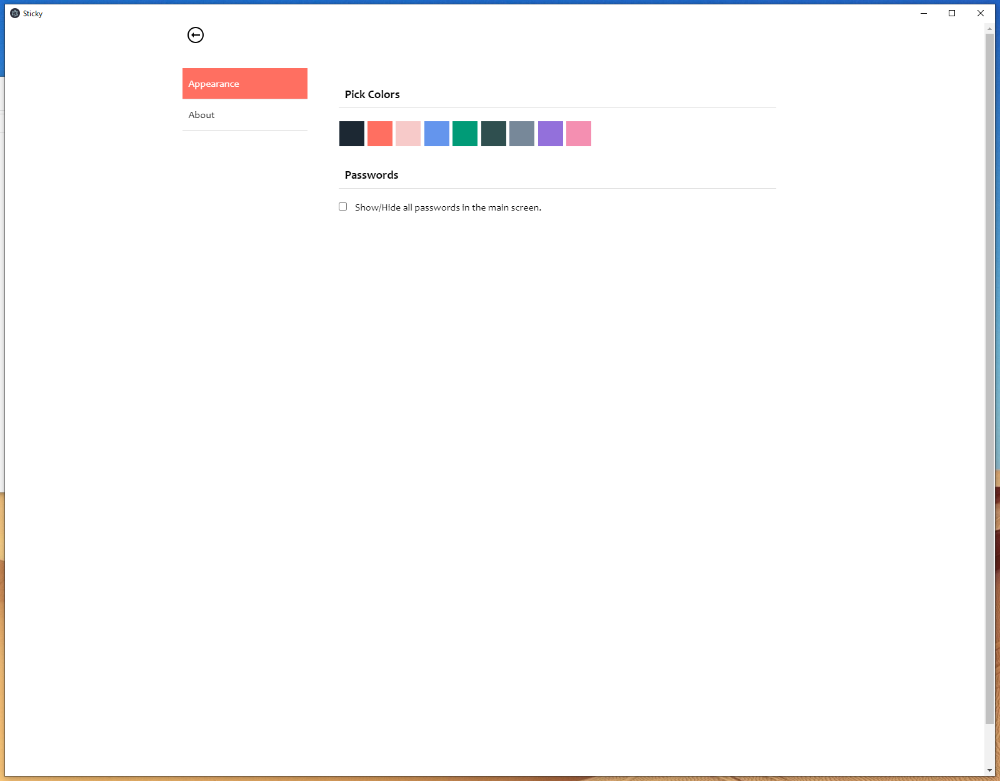

# sticky
 A basic, minimalistic, offline, account manager. Stores and sorts username, emails, and passwords.

 I wanted to learn how to build a cross platform application using Electron.js. This app is it. This is my first desktop application.
 
 Demo Screenshots:
 
 Main screen:
  
 
 Add account:
 
 
 Edit accont:
 
 
 Setting Menu:
 